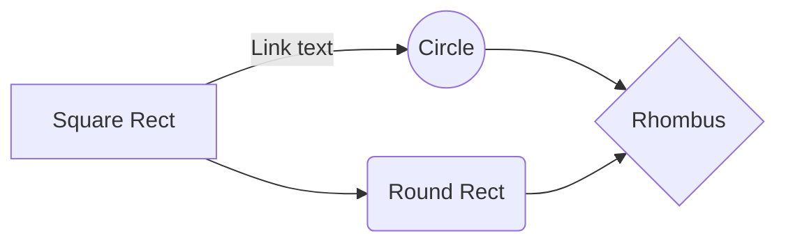

# Generate Pandas Profiling Report using Spark Dataframe as input

Lorem ipsum dolor sit amet, consectetur adipiscing elit. Fusce interdum rutrum arcu placerat volutpat. Nulla rutrum ipsum eu consequat interdum. Nam sem ex, vehicula non scelerisque ut, pharetra nec risus. Fusce id vestibulum ex. Nam lacus mauris, cursus eu felis at, eleifend lobortis leo. Sed auctor, tortor id iaculis lacinia, sapien magna imperdiet urna, ac molestie velit nisi ac ante. Nullam sed imperdiet purus, ac viverra velit. Cras quam sapien, egestas eget convallis vitae, tempor vitae elit.

## Prerequisites

### Applications

 - Java8
 - scala
 - apache-spark
 - python3
	 - `pip3 install pyspark`
	 - `pip3 install pandas`
	 - `pip3 install pandas_profiling`
	 - `pip3 install bs4`

### Python modules 

#### pyspark

[**PySpark**](https://spark.apache.org/docs/latest/api/python/index.html) is the Python API written in python to support Apache Spark. Apache Spark is a distributed framework that can handle Big Data analysis. We use this mostly to read Spark Dataframes and convert them easily to Pandas Dataframes using `toPandas()` function. Converting data frames to pandas gives us the ability to utilize prexisting python libraries such as `pandas_profiling`

#### pandas

[**pandas**](https://github.com/pandas-dev/pandas) is a Python package providing fast, flexible, and expressive data structures designed to make working with "relational" or "labeled" data both easy and intuitive. It aims to be the fundamental high-level building block for doing practical, **real world** data analysis in Python. Additionally, it has the broader goal of becoming **the most powerful and flexible open source data analysis / manipulation tool available in any language**. It is already well on its way towards this goal.

#### pandas_profiling

[**pandas_profiling**](https://github.com/pandas-profiling/pandas-profiling) generates profile reports from a pandas `DataFrame`. The pandas `df.describe()` function is great but a little basic for serious exploratory data analysis. `pandas_profiling` extends the pandas DataFrame with `df.profile_report()` for quick data analysis. This also allows us to create an output html report using `to_file(output_file=output.html)`

## Usage
